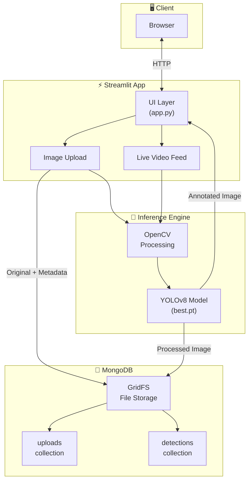

# 🌱 Intelligent Weed Detection

A real-time weed detection application powered by **YOLOv8** and **Streamlit**. Upload images or use your webcam to identify common agricultural weeds with bounding-box annotations.


---

## 🎯 Supported Weed Species

The model is trained to detect the following weed types:

| Weed                | Scientific Name           | Common Regions           |
| ------------------- | ------------------------- | ------------------------ |
| **Horseweed**       | _Conyza canadensis_       | North America, Europe    |
| **Kochia**          | _Bassia scoparia_         | Great Plains, Western US |
| **Redroot Pigweed** | _Amaranthus retroflexus_  | Worldwide                |
| **Ragweed**         | _Ambrosia artemisiifolia_ | North America            |

Upload images containing any of these weeds for automatic detection and annotation.

---

## 🏗️ Architecture



---

## 📦 Features

- **Image Upload**: Supports PNG, JPG, BMP, JPEG formats
- **Live Video Feed**: Real-time webcam inference
- **Bounding Box Annotations**: Visual detection results
- **Download Results**: Save processed images locally
- **Persistent Storage**: MongoDB + GridFS for upload history
- **Confidence Filtering**: Configurable detection thresholds (default: 0.25)

---

## 🚀 Quick Start

### Prerequisites

- Python 3.10+ (3.11 recommended)
- MongoDB instance (local or Atlas)
- Webcam (optional, for live feed)

### 1. Clone the Repository

```bash
git clone https://github.com/ibikigosu/Streamlit-Intelligent-Weed-Detection.git
cd Streamlit-Intelligent-Weed-Detection
```

### 2. Create Environment File

Create a `.env` file in the project root:

```env
MONGO_URI=mongodb://localhost:27017/
# Or for MongoDB Atlas:
# MONGO_URI=mongodb+srv://<username>:<password>@cluster.mongodb.net/?retryWrites=true&w=majority
```

> ⚠️ **Gotcha**: The app will fail to start without a valid `MONGO_URI`. Ensure MongoDB is running before launching.

### 3. Install Dependencies

```bash
pip install -r requirements.txt
```

### 4. Run the App

```bash
streamlit run app.py
```

The app will be available at `http://localhost:8501`

---

## 🐳 Docker Deployment

### Build and Run

```bash
# Build the image
docker build -t weed-detection .

# Run the container
docker run -p 8501:8501 \
  -e MONGO_URI="mongodb://host.docker.internal:27017/" \
  weed-detection
```

### Environment Variables

| Variable    | Required | Description               |
| ----------- | -------- | ------------------------- |
| `MONGO_URI` | ✅       | MongoDB connection string |

> ⚠️ **Docker Gotcha**: Use `host.docker.internal` instead of `localhost` to connect to MongoDB running on the host machine.

---

## ☁️ Heroku Deployment

This project includes Heroku configuration files:

| File           | Purpose                         |
| -------------- | ------------------------------- |
| `Procfile`     | Defines the web process         |
| `setup.sh`     | Configures Streamlit for Heroku |
| `runtime.txt`  | Specifies Python version        |
| `packages.txt` | System dependencies (Aptfile)   |

### Deploy to Heroku

```bash
heroku create your-app-name
heroku config:set MONGO_URI="your-mongodb-uri"
git push heroku main
```

> ⚠️ **Heroku Gotcha**: The `runtime.txt` specifies Python 3.7.13 for compatibility. Update if needed, but test thoroughly—newer Python versions may require dependency updates.

---

## 📁 Project Structure

```
Streamlit-Intelligent-Weed-Detection/
├── app.py                 # Main Streamlit application
├── model/
│   └── best.pt            # YOLOv8 trained weights
├── static/
│   ├── banner_top.png     # UI assets
│   ├── banner_bottom.png
│   └── main_banner.png
├── uploads/               # Local upload directory
├── downloads/             # Local download directory
├── requirements.txt       # Python dependencies
├── Dockerfile             # Docker configuration
├── Procfile               # Heroku process file
├── setup.sh               # Heroku Streamlit config
├── packages.txt           # System dependencies
└── runtime.txt            # Python runtime version
```

---

## ⚙️ Configuration

### Model Parameters

The YOLO model is configured with:

| Parameter | Value | Description                  |
| --------- | ----- | ---------------------------- |
| `conf`    | 0.25  | Minimum confidence threshold |
| `iou`     | 0.45  | IoU threshold for NMS        |

To adjust, modify the `model.predict()` calls in `app.py`:

```python
results = model.predict(source=image, conf=0.25, iou=0.45)
```

### MongoDB Collections

The app automatically creates:

| Collection   | Purpose                        |
| ------------ | ------------------------------ |
| `uploads`    | Metadata for uploaded images   |
| `detections` | Metadata for processed results |

Binary files are stored in GridFS (`fs.files` / `fs.chunks`).

---

## 🔧 Dependencies

| Package                  | Version   | Purpose               |
| ------------------------ | --------- | --------------------- |
| `streamlit`              | ≥1.28.0   | Web UI framework      |
| `ultralytics`            | 8.3.31    | YOLOv8 inference      |
| `opencv-python-headless` | 4.10.0.84 | Image processing      |
| `pymongo`                | ≥4.10.1   | MongoDB driver        |
| `torch`                  | ≥1.8.1    | PyTorch backend       |
| `torchvision`            | ≥0.9.1    | Vision utilities      |
| `Pillow`                 | ≥9.1.0    | Image handling        |
| `python-dotenv`          | —         | Environment variables |

---

## 🛠️ Troubleshooting

| Issue                          | Solution                                                    |
| ------------------------------ | ----------------------------------------------------------- |
| `Failed to connect to MongoDB` | Check `MONGO_URI` in `.env`; ensure MongoDB is running      |
| `Unable to access webcam`      | Grant camera permissions; close other apps using the camera |
| `libGL.so.1: cannot open`      | Install system deps: `apt install libgl1-mesa-glx`          |
| Model loading slow             | First load downloads assets; subsequent loads use cache     |
